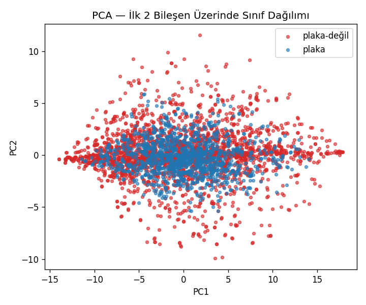
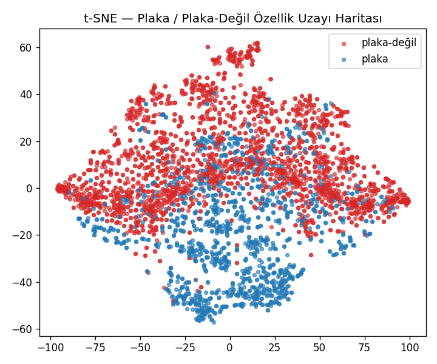
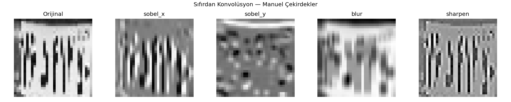
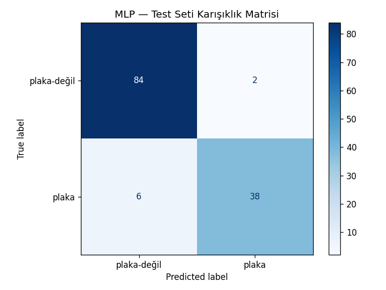
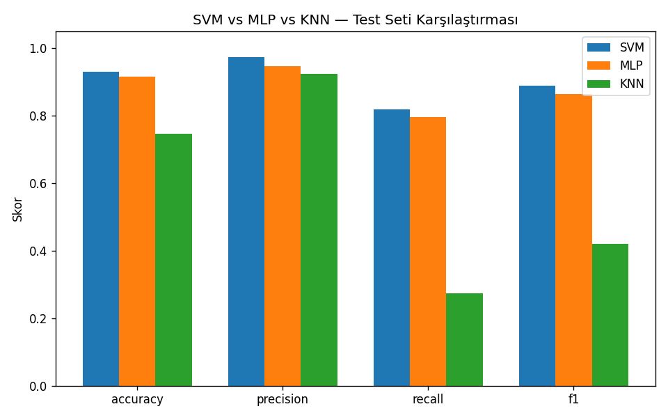

# 🖼️ Görüntü İşleme — Temelden İleri Seviyeye

Bu repo, görüntü işleme konusunu **temel piksel manipülasyonlarından** başlayıp **derin öğrenme fikirlerine, sıfırdan CNN inşasına ve gerçek bir plaka veri setiyle ikili sınıflandırmaya** kadar kapsamlı şekilde sunmaktadır.

| Dosya | Seviye | İçerik |
|---|---|---|
| `image_processing_basics` | Temel | Piksel/kanal analizi, geometrik dönüşümler, renk uzayları, histogram, filtreleme, kenar tespiti, morfoloji, KNN |
| `plaka_pipeline.py` | İleri Seviye | Veri artırma, PCA, t-SNE, sıfırdan konvolüsyon, aktivasyon fonksiyonları, MLP, SVM/MLP/KNN karşılaştırma, Grad-CAM benzeri ısı haritası, sıfırdan CNN |

> **Ön koşul:** İleri seviye dosyayı çalıştırmadan önce temel notebook'un tamamlanmış olması önerilir.

---

## 📦 Repo Yapısı

```
görüntü-işleme/
├── data/
│   ├── train/          # COCO formatlı plaka tespit verisi
│   ├── valid/
│   └── test/
├── outputs/
│   ├── augmented_data/
│   └── *.png           # üretilen grafik ve görselleştirmeler
├── image_processing_basics(.ipynb/.py)   # Temel seviye çalışma
├── plaka_pipeline.py                     # İleri seviye çalışma
└── README.md
```

---

## 1️⃣ Temel Seviye — `image_processing_basics`

### Uygulanan İşlemler

- **Görselleştirme ve Kanal Analizi** — RGB kanallarına ayrılması, piksel değerleri incelenmesi
- **Geometrik Dönüşümler** — Kırpma, yeniden boyutlandırma, döndürme, aynalama
- **Renk Uzayı Dönüşümleri** — Grayscale, HSV, LAB uzaylarına geçiş
- **Histogram Analizi** — Piksel yoğunluk dağılımı ve histogram eşitleme
- **Filtreleme ve Gürültü Giderme** — Ortalama, Gaussian, Medyan, Bilateral filtreleri
- **Kenar Tespiti** — Sobel, Laplacian, Canny kenar dedektörleri
- **Morfolojik İşlemler** — Aşındırma, genişletme, açma, kapama
- **Makine Öğrenmesi** — KNN ile el yazısı rakam sınıflandırma

---

## 2️⃣ İleri Seviye — `plaka_pipeline.py`

### 📚 Bölümler (Zorluk Seviyesi)

| # | Bölüm | Zorluk |
|---|-------|--------|
| 13 | Veri Hazırlama + Veri Artırma | ⭐⭐ |
| 14 | PCA ile Boyut İndirgeme | ⭐⭐ |
| 15 | t-SNE ile Özellik Uzayı Keşfi | ⭐⭐⭐ |
| 16 | Konvolüsyon Katmanı — Sıfırdan NumPy | ⭐⭐⭐ |
| 17 | Aktivasyon Fonksiyonları | ⭐⭐⭐ |
| 18 | Tam Bağlı Sinir Ağı (MLP) | ⭐⭐⭐ |
| 19 | SVM vs MLP vs KNN Karşılaştırma | ⭐⭐⭐ |
| 20 | Grad-CAM Benzeri Isı Haritası | ⭐⭐⭐⭐ |
| 21 | Gerçek CNN Pipeline — Sıfırdan | ⭐⭐⭐⭐ |

### Çalıştırma

```bash
cd görüntü-işleme
python3 plaka_pipeline.py
```

---

## 🛠 Kullanılan Teknolojiler

- **Görüntü İşleme:** OpenCV, Pillow, SciPy
- **Matematik:** NumPy
- **Görselleştirme:** Matplotlib
- **Makine Öğrenmesi:** Scikit-learn

### Kurulum

```bash
pip3 install opencv-python scikit-learn matplotlib numpy pillow scipy
```

---
## 🚀 Çıktılar ve Analizler

Proje boyunca elde edilen temel analizler ve görsel sonuçlar aşağıdadır:

| Analiz Türü | Görsel |
| :--- | :--- |
| **PCA & t-SNE** |  <br>  |
| **Konvolüsyon** |  |
| **Model Başarısı** |  <br>  |

🔍 Çıktı Yorumları ve Analizler
Elde edilen deneysel sonuçlar, görüntü işleme ve derin öğrenme pipeline'ımızın performansını şu şekilde doğrulamaktadır:

PCA ile Boyut İndirgeme: PCA sonuçları, plaka verisinin sahip olduğu varyansın büyük bir kısmının ilk 50 bileşen ile açıklanabildiğini göstermektedir. Bu, modelin gereksiz yüksek boyutlu verilerden arındırılarak daha verimli eğitilmesine olanak tanır.

Özellik Uzayı Analizi: PCA ve t-SNE görselleştirmeleri, "plaka" ve "plaka-değil" sınıflarının özellik uzayında belirli bir ayrışma eğiliminde olduğunu kanıtlamaktadır.

Konvolüsyon İşlemleri: Manuel uygulanan Sobel çekirdekleri, görüntülerdeki kenar ve yapısal bilgilerin derin öğrenme modelleri tarafından nasıl ayırt edilebileceğinin temelini oluşturmaktadır.

Model Performansı: Test seti üzerindeki karşılaştırmalarda SVM ve MLP modelleri yüksek doğruluk ve hassasiyet skorlarına ulaşmıştır. MLP, karışıklık matrisi verilerine göre başarılı bir sınıflandırma performansı sergilemiştir.
